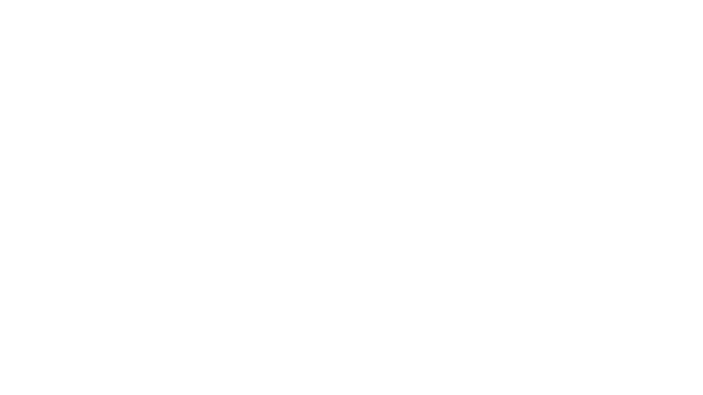

# Asimov - Projeto

## Parte 1

### Ferramentas de Código
- Cursor / OpenCode: Geração e revisão de código

### MCPs
- Figma (FrameLink MCP): Conexão com o Figma para geração de componentes no código

### Skills (Cursor)
- [Vercel React Best Practices](https://skills.sh/vercel-labs/agent-skills/vercel-react-best-practices)
- [Vercel Composition Practices](https://skills.sh/vercel-labs/agent-skills/vercel-composition-patterns)

### Rules
- [Rules gerais do projeto](./parte-1/.cursor/rules/)

---

## Parte 2

### Ferramentas de Código
- OpenCode / Antigravity: Geração de código

### Prototipagem e MCPs
- Stitch: Geração do protótipo
- Figma (FrameLink MCP): Conexão com o Figma para geração de componentes no código

### Rules
- [Rules gerais do projeto](./parte-1/.cursor/rules/)
---

## Etapas com Maior Contribuição da IA

- Prototipagem visual com Stitch e Figma
- Geração de código de componentes
- Revisão e refatoração de código
- Aplicação de regras via Rules

## Ajustes Manuais

- Ajustes de código para melhor adequação de padrões
- Ajustes finos de layout e CSS que a IA não percebe